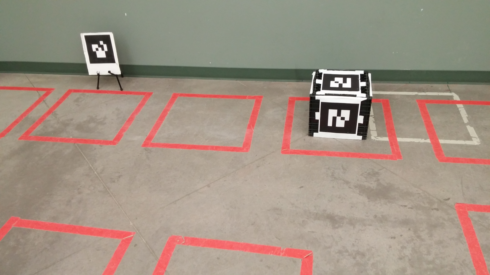
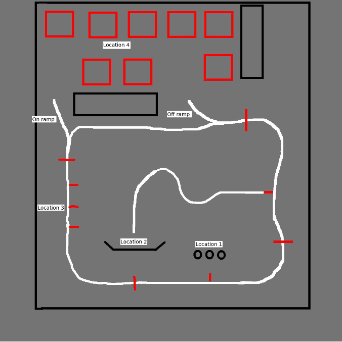
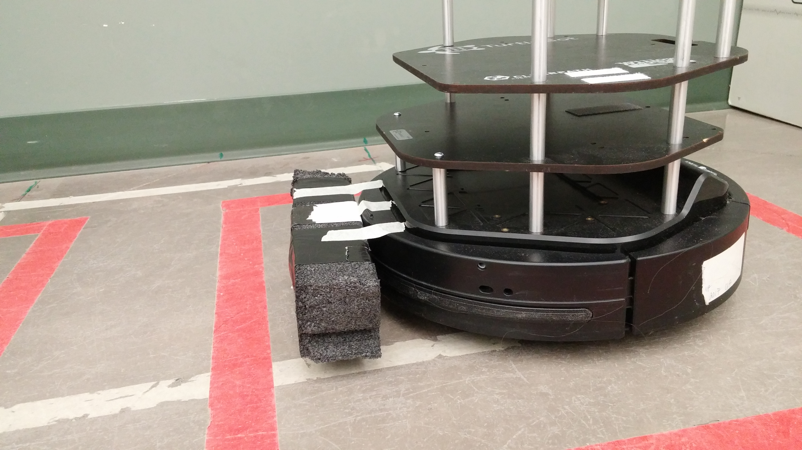

# Competition 4

## Purpose

This repository contains our code for the fourth competition for [CMPUT 412, Experimental Mobile Robotics](https://www.ualberta.ca/computing-science/undergraduate-studies/course-directory/courses/experimental-mobile-robotics). The challenges in each competition are roughly cumulative, and so our solution builds upon our code developed for [competition 2](https://github.com/cmput412-2019/cmput412-competition2) and [competition 3](https://github.com/cmput412-2019/competition3).

As in prior competitions, our robot (a Kobuki Turtlebot) had to run a course which demonstrated line following, shape counting and detection, AR tag detection, and navigation to pre-defined "parking squares" within the course. This competition added *box-pushing*: our robot was tasked with transporting a box (with an AR tag on each side) from a randomly-determined parking square to randomly-determined goal square (marked with a second AR tag). 

 

The parking squares are marked in red tape. The box always started out within a parking square adjacent to the same wall containing the goal AR tag, and so only ever had to be pushed in the "horizontal" direction (along the wall, or tangential to the goal AR tag's surface normal).

#### Competition overview

The competition took place on the following course (the image is from the class, and does not belong to us):

The competition requirements were approximately the following: the robot had to follow the white line (starting near location 1) and complete the tasks at location 1, location 2, location 4 and then location 3. The robot had to stop at each long red line, and was required to stay on the white line at all times except during the location 4 tasks.

 * At location 1, there were up to three red objects, and the robot had to count them.
 * At location 2, there was a green polygon at up to two red polygons. The robot had to count the total number of polygons, and classify the green polygon as either a triangle, a square or a circle. This polygon was to be saved, as the robot was to look for other polygons of the same type later.
 * At location 3, the robot there were three red polygons positioned to the right of each of the short red lines shown in the figure. The polygons were, in some random order, a square, a circle or a triangle. The robot had to stop and look at the shape that matched the green shape found in location 2.
 * At location 4, the robot was required to do two tasks. First, it would search for an AR tag near one of the red squares and push an AR-tagged box to that red square. Next, it would park in the red square that was marked with the polygon it had seen earlier in location 2. Finally, it would navigate back to the white line so it could continue line-following until location 3.
 

## Setup and building

Installation instructions are identical to those in [competition 3](https://github.com/cmput412-2019/competition3#setup-and-building), except
  - The code should be procured by cloning this repository, instead of from the competition 3 release (however, the map from that release should still be used).
  - A block of styrofoam should be attached to the front bumper of the robot to aid box-pushing.
    
    (our exact bumper attachment was modified before this report was written and so could not be photographed, but this image correctly depicts its size and location on the robot)
  - [ar_track_alvar](https://wiki.ros.org/ar_track_alvar) should be installed, as well as any other packages which are missing.

## Running the code

Plug in the Kobuki base, RGB-D camera, and webcam. Open two terminals (e.g. in `tmux`), with `setup.bash` sourced in each of them as per the previous instructions. Then in the first terminal, run

    roslaunch competition4 competition4.launch
    
and in the second,

    export PYTHONPATH=$pwd:$PYTHONPATH
    python src/competition4/scripts/competition4.py

## Method

### Re-used components

We re-use the following components from previous competitions:

  - [Line following](https://github.com/CMPUT412-2019/cmput412-competition2#line-following)
  - [Changing state at red lines](https://github.com/CMPUT412-2019/cmput412-competition2#changing-state-at-red-lines)
  - [Turning](https://github.com/CMPUT412-2019/cmput412-competition2#turning)
  - [Stopping](https://github.com/CMPUT412-2019/cmput412-competition2#stopping)
  - [Mapping and localization](https://github.com/CMPUT412-2019/competition3/blob/master/Readme.md#mapping-and-localization)
  - [Waypoint navigation](https://github.com/CMPUT412-2019/competition3/blob/master/Readme.md#waypoint-navigation)
  - [Identifying and moving toward AR tags](https://github.com/CMPUT412-2019/competition3/blob/master/Readme.md#identifying-and-moving-toward-ar-tags)
  - [Off-ramp and on-ramp](https://github.com/CMPUT412-2019/competition3/blob/master/Readme.md#off-ramp-and-on-ramp)
  - [Searching for a matching shape](https://github.com/CMPUT412-2019/competition3/blob/master/Readme.md#searching-for-a-matching-shape)

### Searching for AR cube and target marker

Before performing box-pushing, the robot must know the location of the AR cube and the target AR tag. To accomplish this, we constantly scan for updates to the estimated pose of the AR tags as given by [ar_track_alvar](https://wiki.ros.org/ar_track_alvar). The latest estimate for a particular tag is saved, giving the robot persistent knowledge of these locations. To ensure the robot has seen all required AR tags, it travels back and forth between two waypoints. At each waypoint, the robot slowly performs a full turn. At any point during this turn, if both AR tags have been located, the search is immediately terminated. In practice, both tags are often located before the robot even reaches the first search waypoint, so the search terminates immediately after reaching that waypoint.

### Box-pushing

We define the target position of the box as a point 40cm in front of the AR tag at the goal square. We then project a line from this point through the center of the box, and navigate 70cm behind the box along this line. The robot then moves along this line until its projected position of the box is at the goal. We control the robot's direction to ensure it is always facing the goal, regardless of any torque from the box. Once this is finished, the robot backs up until it can see the box again, and if the box is sufficiently far from the goal, the box-pushing process repeats.

### Shape detection (locations 2 and 3)

Our shape detection in locations 2 and 3 is much the same as in our last competition, except we changed the backend from OpenCV to a neural network. For training data, we use 37 images of red triangles, 39 images of red squares, and 36 images of red circles. Some of these images are shown below. The rest are available on our [google drive](https://drive.google.com/open?id=1--QkJY5GrKiNM8Kw-sqAc9ELI0G1QXCY).

| Triangle  | Circle | Square
:----------:|:------:|:------:
  |   | 

The images are pre-processed by  cropping to the polygon of interest, converting to grayscale by  and resizing to 28x28. Some pre-processed images are below.

| Triangle  | Circle | Square
:----------:|:------:|:------:
  |   | 

Once pre-processed, we train a model to classify these images according to their shape. We use pytorch's pretrained resnet34, fine-tuned on our images using fastai's one-cycle training for 50 epochs. For further details, see our jupyter notebook on [google colab](https://colab.research.google.com/drive/1QybphdqSyjAzX94g1XvBOjD1zq7Lj2N9).

At inference time, we run the model in a docker container running python 3 and onnxruntime (we can't run it natively as we use python 2 which is incompatible with onnxruntime). We use opencv to find contours of large red and green potential shapes and find the bounding box of each. We convert each potential shape to grayscale, scale them to be 28x28, and use our trained model to determine whether they are squares, circles or triangles.

The rest of shape detection behaves as before (we use various size/distance/etc. filters to extract the desired shapes from our collection of classified shapes).

### Shape detection (location 4)

To park in the square that contains the shape the robot saw at location 2, we store a list of the coordinates of the squares that the shape might be at, then navigate to each one in turn using move_base, using our neural network to identify each polygon the same as we do at location 3. We use a predefined map generated with rtabmap for localization.
